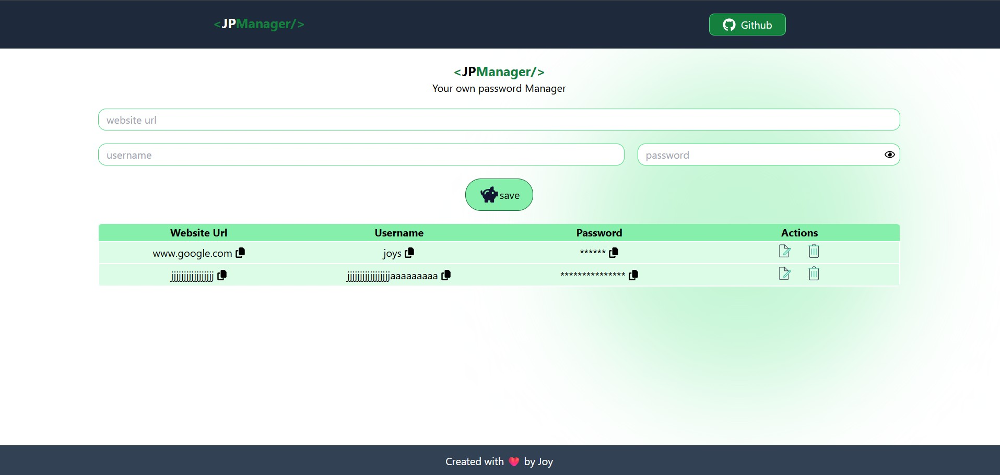

# 🔐 JPManager  

<p align="center">
  
</p>

## 📌 About the Project
**JPManager** is a password manager web application built with **React**, **TailwindCSS**, **Express.js**, and **MongoDB**.  

It allows users to securely **store, edit, and delete** their credentials (website URL, username, and password) in one place.  
This project is designed to help users **easily manage and retrieve their passwords** whenever needed, especially if they forget them.  

During this project, I learned how to integrate **Express.js with MongoDB** to build a full-stack application.  

---

## ✨ Features
- ➕ Create entries with website URL, username, and password  
- ✏️ Edit stored credentials when needed  
- 🗑️ Delete entries easily  
- 🔐 Centralized password management for quick access  
- 📱 Responsive UI with TailwindCSS  

---

## 🛠️ Tech Stack
- **Frontend:** React, TailwindCSS  
- **Backend:** Express.js  
- **Database:** MongoDB  

---

## 🚀 Getting Started

### Prerequisites
Make sure you have installed:
- [Node.js](https://nodejs.org/) (v14+ recommended)  
- npm or yarn  
- A running **MongoDB** instance (local or [MongoDB Atlas](https://www.mongodb.com/atlas))  

### Configuration
Go to backend and then .env and set mongoDB connection string in MONGO_URI

### Installation and run the project
```bash
# Clone the repository
git clone https://github.com/JoySarkar07/PasswordManagerWithMongo.git

# Navigate to the project folder
cd PasswordManagerWithMongo

# Install dependencies
npm install

# Navigate to the server
cd backend

# Install dependencies
npm install

# Start the backend server
npm run start

# Navigate to the project folder
cd ..

# Start the frontend
npm run dev
```